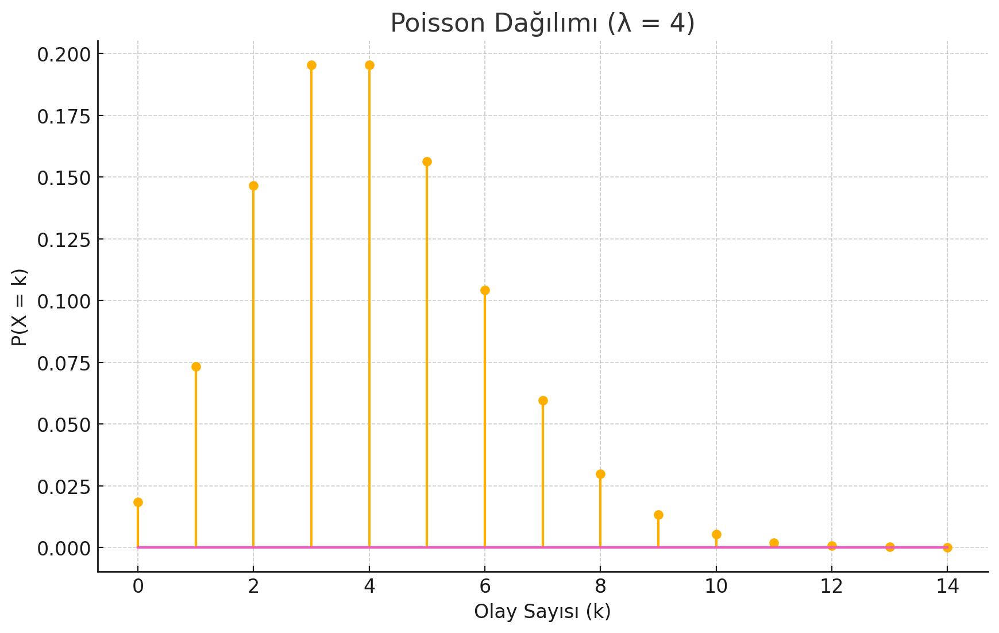
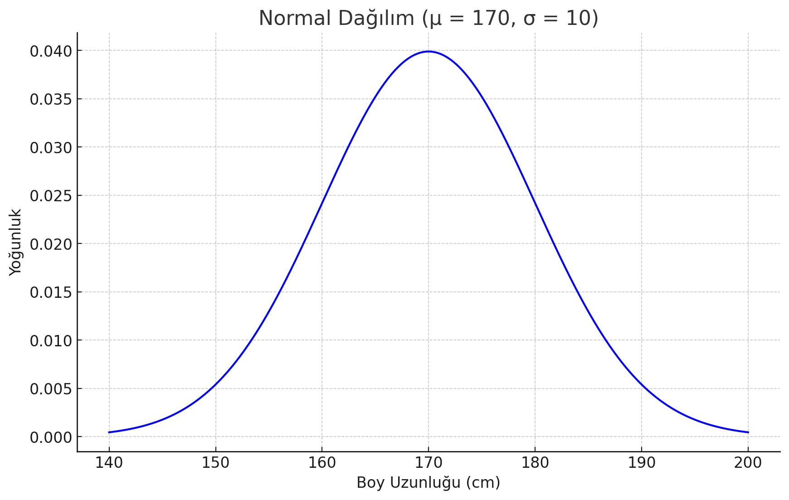

# 1. OLASILIK KÜTLE FONKSİYONU (PMF)

Kesikli rastgele değişkenlerin aldığı belirli bir değerin olasılığını gösteren fonksiyonlardır. (Örneğin, bir çağrı merkezinde belirli bir dakikada kaç çağrı geleceğini düşünelim. Bir dakikada 2.5 gibi bir çağrı olamaz. Bu durumda kesikli bir değişkenden bahsediyoruz.) PMF:

#### P (_X_ = _x_) = _f_(_x_)

şeklinde ifade edilir.

_x_: rastgele değişken

_f_(_x_) : Değişkenin belirli bir değeri alma olaslığı

### POSSION DAĞILIMI İLE PMF GRAFİĞİ

📊 Bu Grafikte:

**X ekseni:** Olay sayısı (k)

**Y ekseni:** Her olay sayısının gerçekleşme olasılığı

En yüksek olasılık, ortalama olay sayısı (λ = 4) civarındadır.

📈 GRAFİK ÜZERİNDEN ÇIKARILABİLECEK YORUMLAR

- Lambda (λ) = 4 → ortalama olay sayısı 4’tür.

* Grafikte en yüksek olasılık, k = 4 için gerçekleşmiş.

- Grafikteki noktalar ayrık → yani sadece tam sayılı değerler mümkün.
  (0, 1, 2, ..., 14 gibi)
- λ = 4 gibi düşük değerlerde Poisson dağılımı sağa çarpıktır (asimetrik). λ büyüdükçe (örneğin λ = 20 gibi) dağılım normal dağılıma yaklaşır ve simetrik olur.

* k > 8 gibi yüksek değerlerde olasılıklar hızla düşer. Yani 8’den fazla olayın oluşma ihtimali çok düşüktür.

- Tüm olası değerlerin toplamı 1’e eşittir:

# 2. OLASILIK YOĞUNLUK FONKSİYONU (PDF)

Sürekli (continuous) değişkenlerin belirli bir aralıkta bulunma olasılığını tanımlar. (Örneğin boy uzuluğu 170.3 cm olabilir). PDF:

                     b
      P(a ≤ X ≤b)=   ∫ f(x) dx  , f(x) ≥ 0 ve toplam alan = 1
                     a

Ortalama (μ) = 170 cm

Standart sapma (σ) = 10 cm

Değişken: Boy uzunluğu

📈 Grafik Yorumları:

- Tepe noktası (maksimum yoğunluk): 170 cm
  → En olası boy değeri.
- Yoğunluk değeri (Y ekseni), olasılık değildir, ama alan olasılığı temsil eder.

  Örneğin: 160–180 cm arası boyda olma olasılığı, bu aralığın altındaki eğrinin alanıdır. Yani **İNTEGRAL** ile hesaplanır.

  💡 NEDEN BÖYLE?

  Sürekli dağılımlarda sonsuz sayıda değer vardır.

  Tek bir değerin olasılığı sıfırdır ama aralıkların olasılığı hesaplanabilir.

  PDF bize yoğunluğu gösterir ama olasılığı değil!

# 3. KÜMÜLATİF DAĞILIM FONKSİYONU (CDF)

CDF, belirli bir değere kadar olan toplam olasılığı gösterir. Örneğin:

- P(X ≤1) = 1/6
- P(X ≤2) = 2/6
- P(X ≤3) = 3/6
- P(X ≤4) = 4/6
- P(X ≤5) = 5/6
- P(X ≤6) = 1

Bu grafik sayesinde:

- Zar gibi diskret değişkenlerin toplam olasılıklarını görebiliriz.

- CDF grafikleri ile aralık olasılıkları hesaplamayı öğrenebiliriz.
