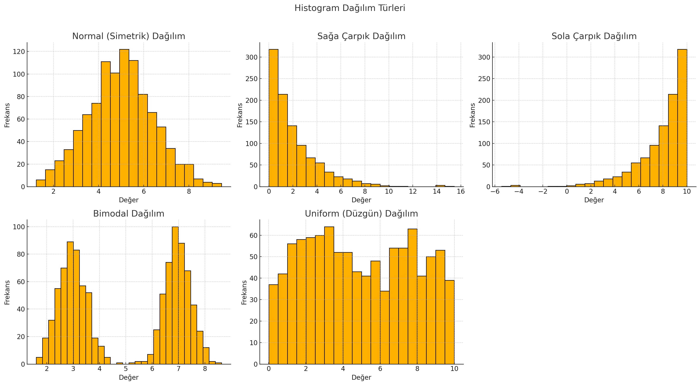

# VERİ BİLİMİ İÇİN İSTATİSTİK

Temelde 2'ye ayrılır:

1. **Descriptive**

   1.1. mean(ortalama)

   1.2. median

   1.3. variance

   1.4. standart sapma

2. **Inferential**

   - veri topla
   - örneklem al
   - deneyler yap
   - bunlara bakarak sonuç çıkar

#### Popülasyon ->Çalışmanın ilgilendiği tüm grup

#### Örneklem(sample) -> popülasyondan seçilmiş daha küçük grup

1.1. Mean (Ortalama)

| Popülasyon | Örneklem (Sample) |
| ---------- | ----------------- |
| µ=∑x/n     | x̅= ∑x/n           |

1.2. Median

Eğer OUTLIER DATA(çıkıntı veri) varsa önemlidir. Yani veride ortalamayı çok yükselten değer varsa önemli hale gelir.

1.3. Mod

En sık tekrarlanan değer

#### _NOT_: MEDYAN, ORTALAMA, MOD measure of central tendency (merkezi eğilim ölçüsü)'dür. Bu hesaplamaların hepsini yaparak veriyi anlamlandırmaya çalışırız, aralarında büyük farklar var mı analiz etmeye ederiz.

1.4. Varyans

### σ² = ∑x(Xi-µ)² / n

1.5. Standart Sapma

### σ

ile gösterilir. Standart sapma arttıkça ortalamadan daha fazla yazılım, sapma olduğunu söyleyebiliriz.

#### _NOT_ : Varyans ve Standart Sapma, Measure of Dispersion (Yayılım Ölçüsü)'dür. Varyans, verilerin ortalamadan ne kadar saptığını ölçer ama karesi olduğundan dolayı yorumlamak zor olabilir. Standart Sapma ise varyansın karekökü olduğu için, verileri orjinal birimine geri döndürerek yorumlamayı kolaylaştırır.

##### Örnek:

| Sınıf | Ortalama (µ) | Varyans (σ²) | Standart Sapma (σ) |
| ----- | ------------ | ------------ | ------------------ |
| A     | 70           | 2.5          | 1.58               |
| B     | 68           | 625          | 25                 |

Bu tabloya bakarak, A sınıfındakilerin notlarının birbirine daha yakın olduğunu ve B'ye göre daha az yayılım olduğunu söyleyebiliriz. B'de ise daha geniş yayılım olmuş, bazı öğrenciler çok iyi bazıları çok kötü olduğu için notlar arasında daha büyük fark var diyebiliriz.

#### POPÜLASYON - SAMPLE FARKI

| Popülasyon Varyansı | Örneklem (Sample) Varyansı |
| ------------------- | -------------------------- |
| σ² = ∑x(Xi-µ)² / n  | S² = ∑x(Xi-µ)² / (n-1)     |

**Neden Sample'da _n-1_ yapıyoruz?**

Popülasyon varyansını daha doğru tahmin etmek için formül düzeltilmiştir. Bir örneklem kullanarak tüm popülasyonu tahmin ettiğimizde oluşan yanlılığı (BIAS) düzeltmek önemlidir. \*n-1 yaparak bias'ı azaltmaya çalışıyoruz.

### VARİABLE (DEĞİŞKENLER)

- **Sayısal Değişkenler**

  - Sürekli Değişkenler ( Continuous Variable)

    Sonsuz değer alabilir. ÖR: Öğrencinin sınav puanı (ondalıklı değerler de alır)

  - Kesikli Değişkenler (Discrete Variable)

    Sayılabilir değerler alır daha çok tam sayı. ÖR: Sınıftaki öğrenci sayısı

* **Kategorik Değişkenler**

  - Nominal

  Sıralama yok. ÖR: (kadın,erkek)

  - Ordinal

  Sıralama var ama aralık yok. ÖR: (çaylak,deneyimli,uzman)

#### **_NOT:_** Random Variable, Variable'dan farklıdır. Random değerler, bir deneyin **_olası_** sonuçlarını sayısal olarak temsil eden değişkenlerdir.

- Ayrık Rastgele Değişken (Discrete Random Variable): sayılabilir, tam sayı değerler

  ÖR: Bir zar atıldığında gelen sayı: {1, 2, 3, 4, 5, 6}

- Sürekli Rastgele Değişken (Continuous Random Variable): Sonsuz sayıda değer alabilir

  ÖR: Sınav süresi: 45.3 dakika, 59.999 dakika

## HİSTOGRAM

Histogram,**sayısal** bir veri kümesinin frekans dağılımını gösteren bir grafiktir.

- **x ekseni:** Bin sayısı azsa(aralıklar), aşırı genellenmiş ynai veri kaybı olabilir. Fazlaysa, gürültü artar yorum zorlaşır. Bin sayısını seçmek için bazı yöntemler şunlardır:

  - Sturges' Rule

  - Scott’s Rule

  - Freedman-Diaconis Rule

- **y ekseni:** Her aralıktaki gözlem sayısı (frekans)

### Histogramdan Çıkarılabilecek Bilgiler

Verinin dağılımı: Normal mi, çarpık mı?

Mod: En sık gözlenen aralık

Çarpıklık (Skewness): Sağ ya da sol kuyruklu

Outlier’lar (aykırı değerler): Aşırı frekansı düşük olan kenar bölgeler

Kümülatif bilgi içermez – sadece dağılım frekansını verir.

### 📊 Histogramda Dağılım Türleri ve Özellikleri

| Dağılım Türü      | Kuyruk Yönü    | Ortalama - Medyan - Mod     | Açıklama                                                    | Örnek Kullanım Alanı                                  |
| ----------------- | -------------- | --------------------------- | ----------------------------------------------------------- | ----------------------------------------------------- |
| Normal (Simetrik) | Yok            | Ortalama ≈ Medyan ≈ Mod     | Veriler ortalama etrafında simetrik dağılır.                | Boy, kilo, sınav notları                              |
| Sağa Çarpık       | Sağda          | Ortalama > Medyan > Mod     | Düşük değerler yoğun, yüksek değerlerde uzun kuyruk vardır. | Gelir, site giriş süresi, işlem süresi                |
| Sola Çarpık       | Solda          | Ortalama < Medyan < Mod     | Yüksek değerler yoğun, düşük uçlarda uzun kuyruk vardır.    | Emeklilik yaşı sonrası yaşam süresi, sınav başarıları |
| Bimodal           | Yok (İki Tepe) | Değişken olabilir (iki mod) | Dağılımda iki farklı zirve (mod) bulunur.                   | İki müşteri tipi, iki yaş grubu                       |
| Uniform (Düzgün)  | Yok            | Yaklaşık eşit               | Tüm değerlerin ortaya çıkma olasılığı benzerdir.            | Zar atma, rastgele sayı üretimi                       |

### YÜZDE (PERCENTAGE): Yüzde, bir değerin 100 birimlik bir bütün içindeki oranını ifade eder.

### YÜZDELİK (PERCENTILE)

| Kavram       | Açıklama                                             |
| ------------ | ---------------------------------------------------- |
| **Yüzde**    | Bir değerin toplam içindeki oranı. (Pay/Bütün × 100) |
| **Yüzdelik** | Bir değerin veri setindeki sıralamadaki konumu.      |

Veri:
[10, 20, 30, 40, **50,** 60, 70, 80, 90, 100]
(Sıralı 10 eleman)

50.yüzdelik (medyan) = 50
→ Verinin %50’si 50’nin altında

25.yüzdelik (Q1) = 30
→ Verinin %25’i 30’un altında

90.yüzdelik = 90
→ Verinin %90’ı 90’ın altında

### ÇEYREKLİK (QUARTILE)

Çeyreklikler, sıralanmış bir veri setini dört eşit parçaya bölen üç temel değerdir:

| Çeyreklik Adı    | Simgesi | Anlamı                                                        |
| ---------------- | ------- | ------------------------------------------------------------- |
| **1. Çeyreklik** | Q1      | Verilerin en küçük %25’lik kısmının üst sınırı (25. yüzdelik) |
| **2. Çeyreklik** | Q2      | Verilerin ortası, yani **medyan** (50. yüzdelik)              |
| **3. Çeyreklik** | Q3      | Verilerin %75’lik kısmının üst sınırı (75. yüzdelik)          |

### **Q1 - Q2 - Q3 ÖRNEK**

numaralar = (2, 4, 6, 8, 10, 12, 14, 16, 18, 20, 22)

25.Yüzdelik:
Pozisyon = (25 / 100)×11 = 2.75

2.75 tam sayı olmadığı için 3'e yuvarlıyoruz.

    25.yüzdelik’e denk gelen 3. sıradaki numara = 6

50.Yüzdelik:
Pozisyon = (50 / 100)×11 = 5.5

5.5 tam sayı olmadığı için 6'ya yuvarlıyoruz.

    50.yüzdelik’e denk gelen 6. sıradaki numara = 6

75.Yüzdelik:
Pozisyon = (75 / 100)×11 = 8.25

8.25 tam sayı olmadığı için 9'a yuvarlıyoruz.

    75.yüzdelik’e denk gelen 9. sıradaki numara = 18

### 🔎 IQR - Interquartile Range (Çeyrekler Arası Aralık)

Çeyrekliklerin en yaygın kullanım alanı: IQR ile aykırı değer (outlier) tespiti.

#### 𝐼𝑄𝑅 = 𝑄3 − 𝑄1

🔺 Aykırı Değer Sınırları:

**_Alt sınır:_** Q1 – 1.5 × IQR

**_Üst sınır:_** Q3 + 1.5 × IQR

**→ Bu sınırların dışında kalanlar aykırı (outlier) kabul edilir.**

### 5 NUMARA ÖZETLERİ

İstatistikte 5 sayısal özet (Five Number Summary), bir veri setinin dağılımını tanımlamak için kullanılan temel ölçülerdir:

- Minimum
- Q1 (Birinci Çeyrek / Quartile 1)
- Median (Medyan)
- Q3 (Üçüncü Çeyrek / Quartile 3)
- Maksimum

## KOVERYANS (COVARIANCE)

2 değişkenin birlikte nasıl değiştiğini gösteren ölçüt.

- Pozitif Koveryans: Bir değişken artarken diğeri de artıyorsa(veya ikisi de azalıyorsa)

- Negatif Koveryans: Bir değişken artarken diğeri azalıyorsa yani ters yönlü hareket varsa

## KORELASYON (CORRELATION)

Korelasyon da iki değişken arasındaki ilişkinin gücünü ve yönünü ölçen bir değerdir. Koveryanstan farklı olarak, korelasyon her zaman **-1 ile 1** arasında bir değer alı. Bu, onu daha anlaşılır ve karşılaştırılabilir yapar.

- 1'e yakınsa -> güçlü korelasyon
- -1'e yakınsa -> zayıf korelasyon
- 0'a yakınsa -> değişkenler arasında belirgin bir ilişki yok

| Korelasyon Türü | Ne zaman kullanılır?           | Formül Özeti                         |
| --------------- | ------------------------------ | ------------------------------------ |
| Pearson         | Doğrusal ilişkili sayısal veri | Kovaryans / (StdSapmaX \* StdSapmaY) |
| Spearman        | Sıralı/monoton veriler         | 1 - (6 \* ∑d²) / (n(n² - 1))         |
| Kendall Tau     | Sıralı, küçük örneklem         | (C - D) / Tüm çiftlerin toplamı      |

## KOVERYANS - KORELASYON ÖRNEK:

| Gün | Sıcaklık (°C) | Dondurma Satışı |
| --- | ------------- | --------------- |
| 1   | 20            | 40              |
| 2   | 22            | 45              |
| 3   | 24            | 50              |
| 4   | 26            | 55              |
| 5   | 28            | 60              |

| xi             | xi − X̄          | yi             | yi − Ȳ            | (xi − X̄)(yi − Ȳ)            |
| -------------- | --------------- | -------------- | ----------------- | --------------------------- |
| 20             | -4              | 40             | -10               | 40                          |
| 22             | -2              | 45             | -5                | 10                          |
| 24             | 0               | 50             | 0                 | 0                           |
| 26             | 2               | 55             | 5                 | 10                          |
| 28             | 4               | 60             | 10                | 40                          |
| **Σ xi = 120** | ∑ (xi- X)^2 =40 | **Σ yi = 250** | ∑ (xi- Y)^2 = 250 | **Σ(xi − X̄)(yi − Ȳ) = 100** |

#### KOVERYANS = 100 / 5 = 20

𝛔x = √(40/5) = √8

𝛔y = √(250/5) = √50

𝛔x × 𝛔y = 20

#### KORELASYON = 20 / 20 = 1
