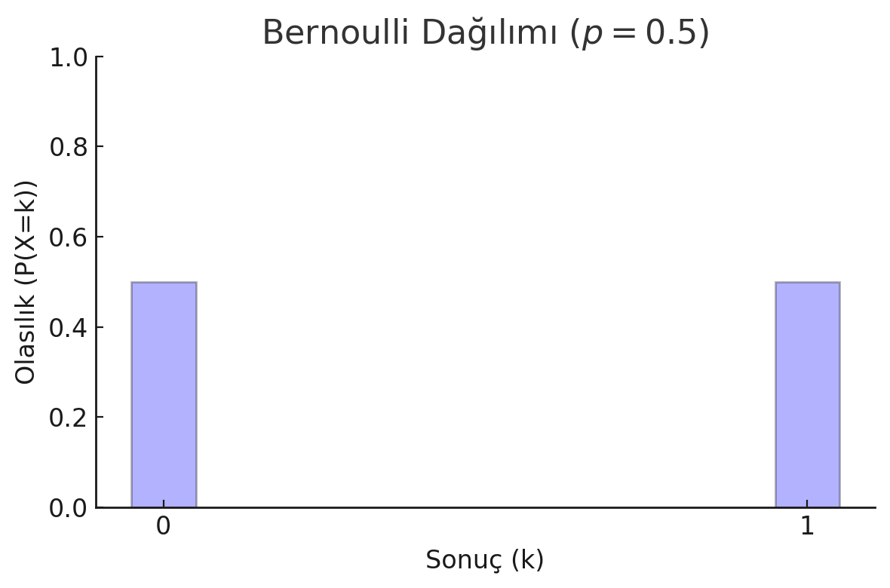
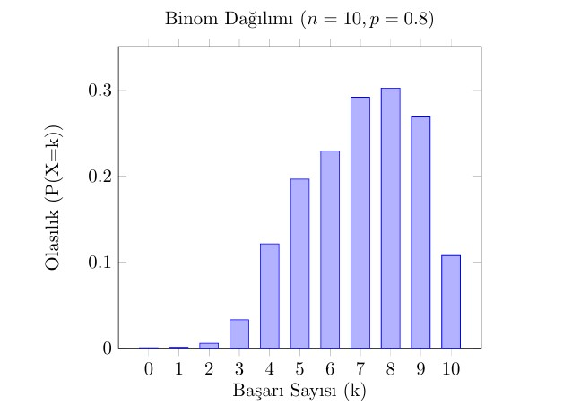
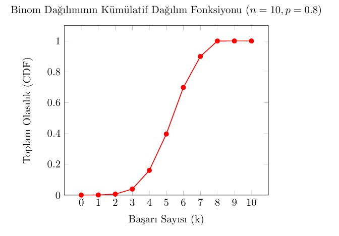
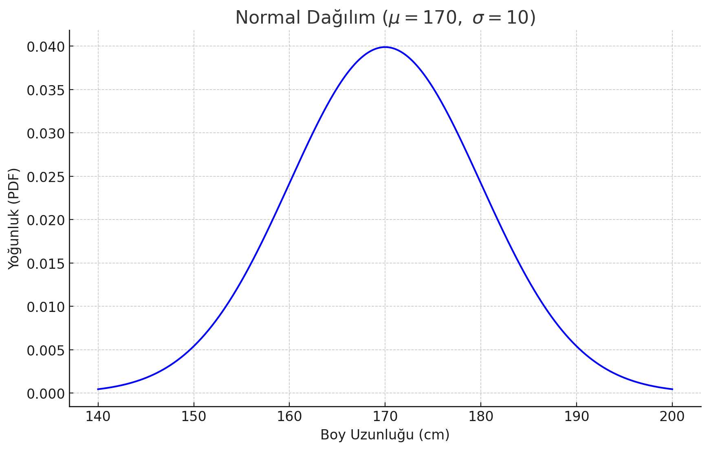
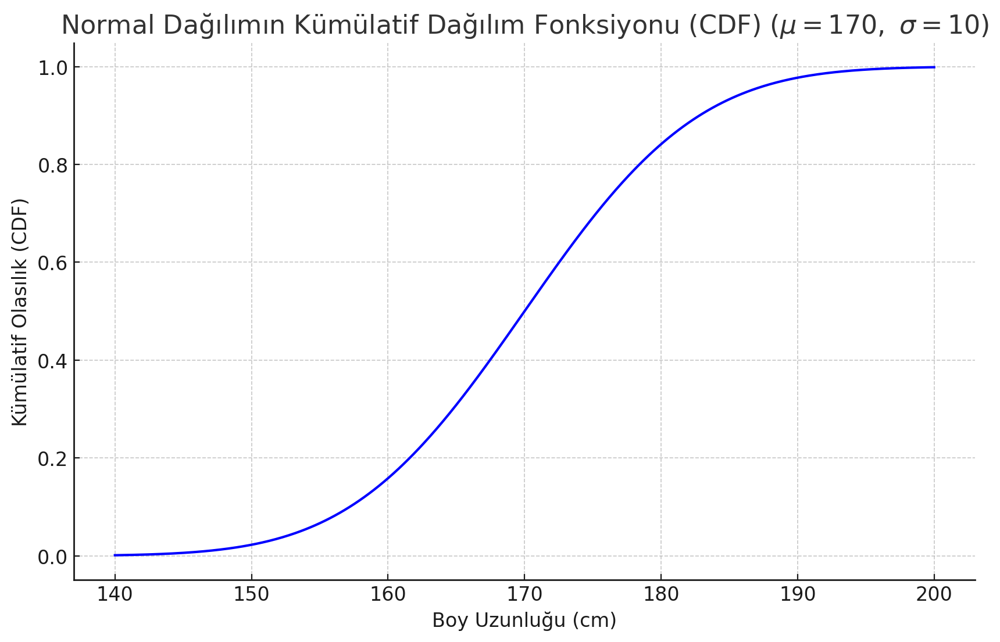
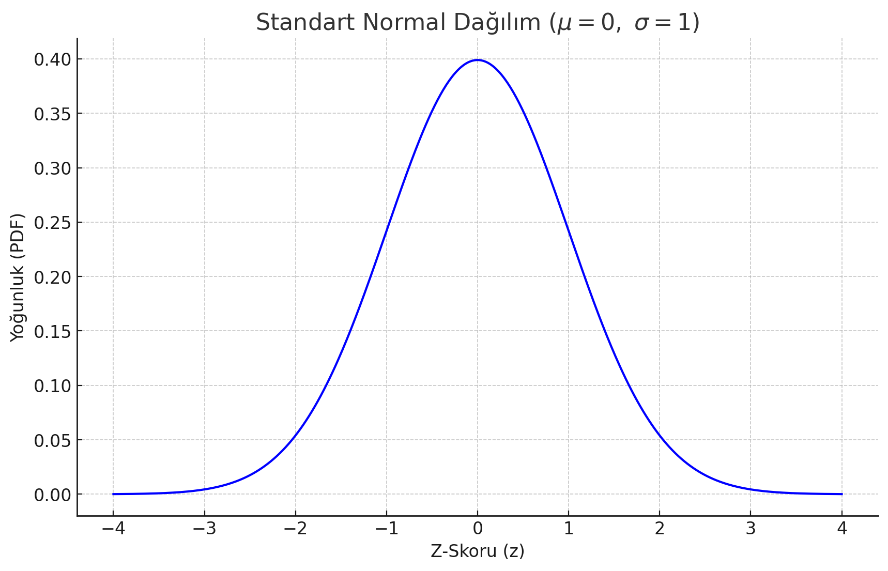
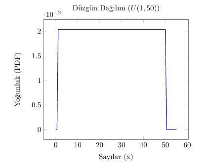
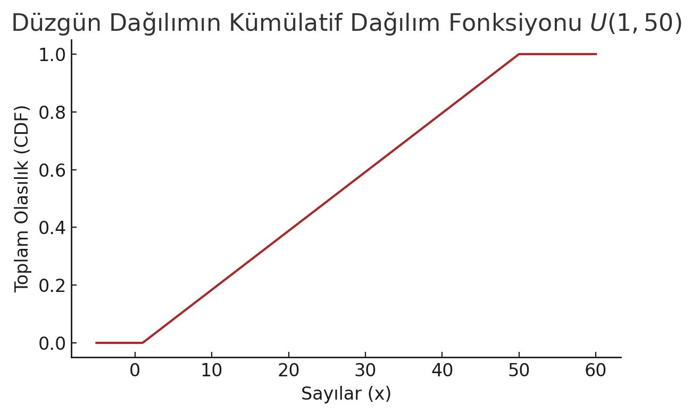
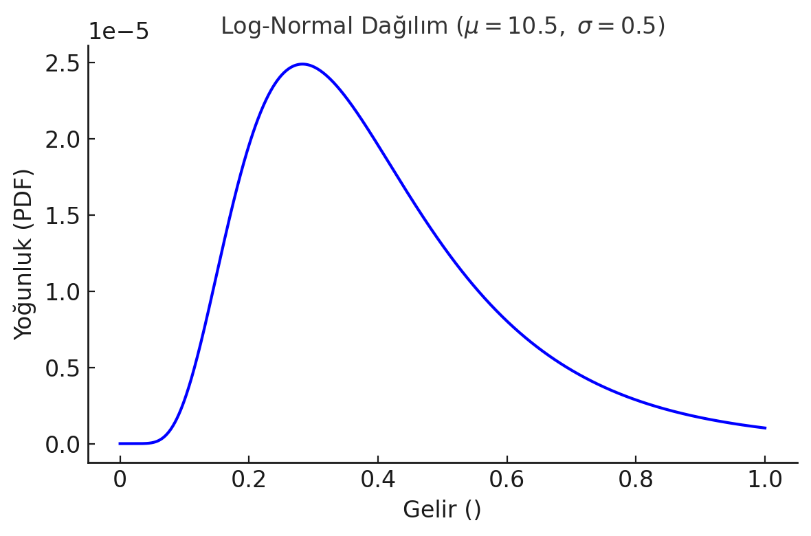
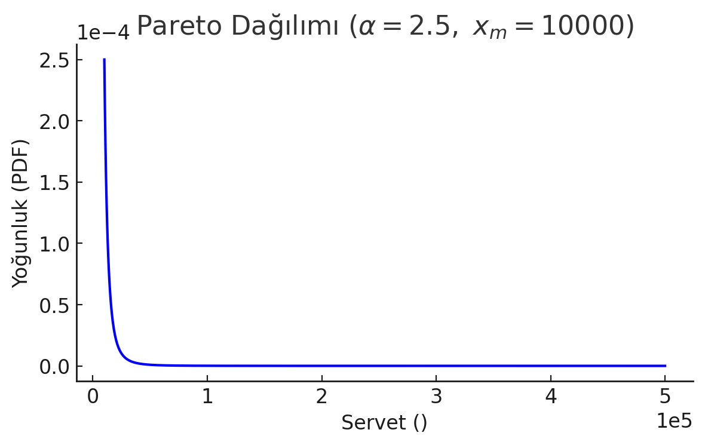

# DAĞILIM FONKSİYONU ÇEŞİTLERİ

# 1- BERNOUILLI DAĞILIMI

- Başarı (1) veya başarısızlık (0) içeren deneyler için kullanılır
- Tek bir deneme için geçerlidir(ör: bir madeni para atışı)
- Başarı olasılığı _p_, başarısızlık olasılığı _1-p_ olarak ifade edilir

### ÖRNEK - MADENİ PARA ATIŞI

Bir madeni para atıldığında:

- Tura gelme olasılığı: P(X = 1)= 0.5
- P (X = 0) = 1 - 0.5 = 0.5

Sonuç: Tura gelme olasılığı=yazı gelme olasılığı

- 𝑃(𝑋=0)=0.5

- 𝑃(𝑋=1)=0.5

### BERNOULLI DAĞILIMININ ÖNEMİ

- İkili(binary) olayları modellemek için temel bir dağılımdır.

* Binom dağılımının temel yapı taşıdır.

# 2- BİNOM DAĞILIMI

Binom dağılımı, bağımsız ve aynı olasılıkla gerçekleşen _n_ adet Bernoulli denemesinin başarı sayısını modelleyen bir dağılımdır.

- Her denemenin iki olası sonucu vardır
- Her denemenin başarı olasılığı sabittir
- Denemeler bağımsızdır (bir denemenin sonucu diğerini etkilemez)

        P(X =k)= C(n,k) p^k * (1−p)^n−k

#### ÖRNEK - BASKET ATIŞI

Bir basketbol oyuncusunun bir serbest atışta başarı olasılığı _p_ = 0.8. Oyuncu 10 serbest atış yaparsa, tam olarak 8 tanesini başarılı atma olasılığı:

P(X = 8) = c(10,8) (0.8^8) (0.2^2) = 10! / 8!(10-8)! \* 0.1678 = 0.302

### BİNOM DAĞILIMININ ÖNEMİ

- Bağımsız denemelerde başarı sayısını modellemek için kullanılır
- Bernoulli dağılımının genişletilmiş halidir

### Bernoulli ve Binom Arasındaki Fark

|                   | **Bernoulli Dağılımı** | **Binom Dağılımı**                               |
| ----------------- | ---------------------- | ------------------------------------------------ |
| **Deneme Sayısı** | 1                      | \( n \)                                          |
| **Sonuçlar**      | 0 veya 1               | 0'dan \( n \)'e kadar başarı sayısı              |
| **Örnek**         | Madeni para atma       | Basket atışları, madeni paranın 10 kere atılması |

# 3- POISSON DAĞILIMI

-olay sayısını ölçmeye yönelik-

Belirli bir zaman veya mekan aralığında meydana gelen **normal** olayların olasılığını hesaplamada kullanırız.

- **Belirli bir zaman diliminde** veya **belirli bir bölgede** gerçekleşen olayları modellemek için uygundur
- Olayların bağımsız olması ve belirli bir ortalama hızda gerçekleşmesi gerekir.

📊 Nerelerde Kullanılır?

- Örneğin, dakikada gelen müşteri sayısı, bir web sitesine saniyede gelen istekler, telefon santraline gelen çağrılar, Bir yol kesitinden geçen araç sayısı (sabit sürede)

PMF Formülü:

        P (X = k) = λ. (e ^ −λ) / k!   ,   k = 0,1,2,...

        k = gerçekleşen olay sayısı
        λ = belirli bir zaman diliminde veya mekanda beklenen ortalama olay sayısı
        e = euler sayısı (e ≈ 2.718)

### ÖRNEK - ÇAĞRI MERKEZİ ÖRNEĞİ

Bir çağrı merkezine saatte ortalama 5 çağrı geldiğini düşünelim (λ = 5). Şimdi bu çağrı merkezine tam olarak 3 çağrı gelme olasılığı:

P (X = 3) = 5³ × e^(-5) / 3! ≈ 0.1404

# 4- NORMAL (GAUSSIAN) DAĞILIM

- Çan eğrisi şeklindedir
- Ortalamaya yakın değerler daha olasıdır, uç değerlerin olasılığı düşüktür
- Simetriktir, yani ortalamadan eşit uzaklıktaki değerler eşit olasılığa sahiptir
- PDF Formülüyle gösterilir

### ÖRNEK - İNSAN BOYU UZUNLUĞU

Bir toplumdaki bireylerin boy uzunlukları genellikle normal dağılıma uyar.

ortalama = μ = 170 cm
standart sapma = σ = 10 cm

#### Grafik Üzerinden Yorumlar:

- En yüksek tepe noktası (zirve), 170 cm’de; bu da en sık görülen boy uzunluğudur.

- Eğri simetriktir; 170 cm etrafında düzgün dağılmıştır.

- Dağılımın yaklaşık %68’i [160, 180] aralığındadır (yani ±1σ).

- PDF değerleri, doğrudan olasılığı vermez ama olasılık yoğunluğunu gösterir. Belirli bir aralıktaki olasılığı bulmak için alan (integral) alınır.

- CDF grafiği monoton artan bir eğridir (hiç azalmaz).
- Y ekseninde değerler 0’dan başlar ve 1’e kadar çıkar (toplam olasılık = 1).

# 5- STANDART NORMAL DAĞILIM

ortalama = μ = 0 ve

standart sapma = σ = 1 olan dağılımlardır.

#### Bu dağılım herhangi bir normal dağılımı ölçekleyerek analiz etmeyi kolaylaştırır.

## Z-SKORU

        Z = (X - μ) / σ

Ör: Bir sınavda ortalama puan 75, standart sapma 10. Ali'nin puanı 90 ve Zeynep'in puanı 60 ise:

Z(Ali) = (90-75)/10 = 1.5

Z(Zeynep) = (60-75)/10 = -1.5

# 6- UNIFORM DAĞILIM

Belirli bir aralık içindeki tüm değerlerin eşit olasılıkla gerçekleştiği olasılık dağılımı.

Sürekli ve kesikli türleri vardır.

Yukarıdaki grafik,
𝑈(1 , 50) aralığında tanımlı düzgün (uniform) dağılımın PDF (Probability Density Function) grafiğidir.

Yukarıdaki grafik, 𝑈(1,50) düzgün dağılımının Kümülatif Dağılım Fonksiyonu (CDF) grafiğidir. Bu grafik:

𝑥<1 için olasılığın 0 olduğunu,

1≤𝑥≤50 arasında doğrusal olarak arttığını,

𝑥>50 için olasılığın 1 olduğunu

gösterir.

# 7- LOG - NORMAL DAĞILIM

- Sağa çarpık bir dağılımdır. Veriler sol tarafta dağılmıştır.
- Sıfırdan büyük değerler için uygundur, negatif değerler alamaz.

#### ÖRNEK - GELİR DAĞILIMI

Çoğu insanın geliri ortalamaya yakındır. Bazı insanlar aşırı yüksek gelir elde eder. Negatif gelir mümkün değildir.

- Düşük gelir gruplarında yoğunluk fazla
- Gelir arttıkça olasılık azalır, ancak sıfıra ulaşmaz
- Çok yüksek gelirli kişiler nadirdir ancak mümkündür

# 8- PARETO DAĞILIM

Bazı sistemlerde az sayıda büyük değer ve çok sayıda küçük değer bulunduğunu gösteren çarpık bir dağılımdır.

Bu dağılım **Güç Kanunu(Power Low)** ile yakından ilişkilidir

- 80/20 Kuralı olarak bilinen Pareto prensibini temsil eder.
- Servet Dağılımı, sosyal medya takipçi sayıları, şehir nüfusları
- Sağa çarpık bir dağılımdır

#### ÖRNEK - SERVET DAĞILIMI

- Düşük servet gruplarında yoğunluk fazla
- Servet arttıkça olasılık hızla düşmekte
- Çok zengin bireyler nadir ancak mümkün

## 📊 ÖZET TABLO

| Dağılım Türü        | Temel Özellikler                                                      | Formül / Parametreler                            | Örnek Uygulama                      |
| ------------------- | --------------------------------------------------------------------- | ------------------------------------------------ | ----------------------------------- |
| **Bernoulli**       | Tek deneme, 0 veya 1 sonucu                                           | $p, 1-p$                                         | Madeni para atma                    |
| **Binom**           | $n$ bağımsız Bernoulli denemesi                                       | $P(X = k) = C(n,k) \cdot p^k \cdot (1-p)^{n-k}$  | 10 serbest atışta kaç basket olur?  |
| **Poisson**         | Belirli zaman/mekânda olay sayısı                                     | $P(X = k) = \frac{{\lambda^k e^{-\lambda}}}{k!}$ | Dakikada gelen çağrı sayısı         |
| **Normal**          | Simetrik, çan eğrisi, ortalamaya yakınlık ön planda                   | $\mu, \sigma$, PDF ve CDF                        | Boy uzunluğu                        |
| **Standart Normal** | $\mu = 0, \sigma = 1$, diğer normal dağılımlar Z-skoruna dönüştürülür | $Z = \frac{X - \mu}{\sigma}$                     | Sınav puanlarının karşılaştırılması |
| **Uniform**         | Belli bir aralıkta her değerin eşit olasılığı vardır                  | $U(a, b)$, sabit yoğunluk                        | Zar atımı, rastgele sayı üretimi    |
| **Log-Normal**      | Sağa çarpık, negatif değer alamaz, veriler çarpıktır                  | $\mu, \sigma$ (log üzerinde normal)              | Gelir dağılımı                      |
| **Pareto**          | Az sayıda büyük, çok sayıda küçük değer – 80/20 kuralı                | $\alpha, x_m$                                    | Servet dağılımı, şehir nüfusları    |

📌 Notlar

- Bernoulli, Binom’un yapı taşıdır.

- Poisson, nadiren meydana gelen olaylar için uygundur.

- Normal, doğal ölçümlerde yaygındır.

- Uniform, tüm olasılıkların eşit olduğu durumlardır.

- Log-Normal, pozitif veriler için uygundur, gelir dağılımı gibi.

- Pareto, büyük farkların olduğu sistemleri açıklar (servet, takipçi sayısı). Güç yasası → 80/20 kuralı. Azınlık çokluğu elinde tutar.
